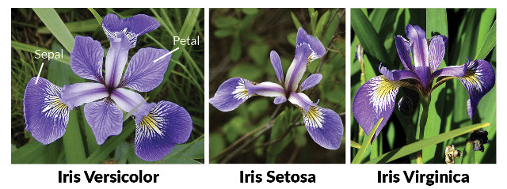
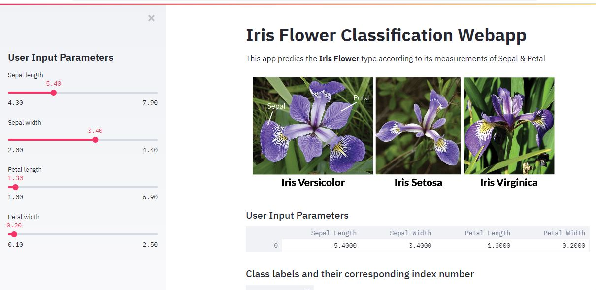
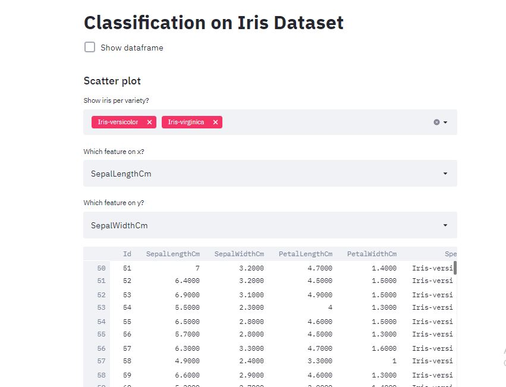
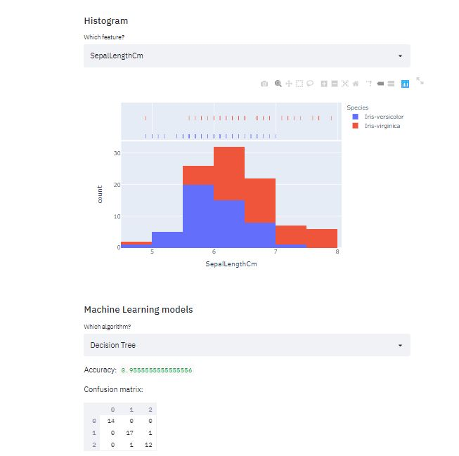

# Decision-Tree-Classifier-Iris-Dataset

This app predics the **Iris Flower** type according to its measurements of its Sepal & Petal.

Your can build webapps of it using streamlit library.

Steps:

1. In your terminal install streamlit library by-
pip install streamlit

2. Write you ML code and save it in .py extension so that you ca run it on your terminal.
3. In your terminal go to path where your file is saved thenn write-
streamlit run filename.py

